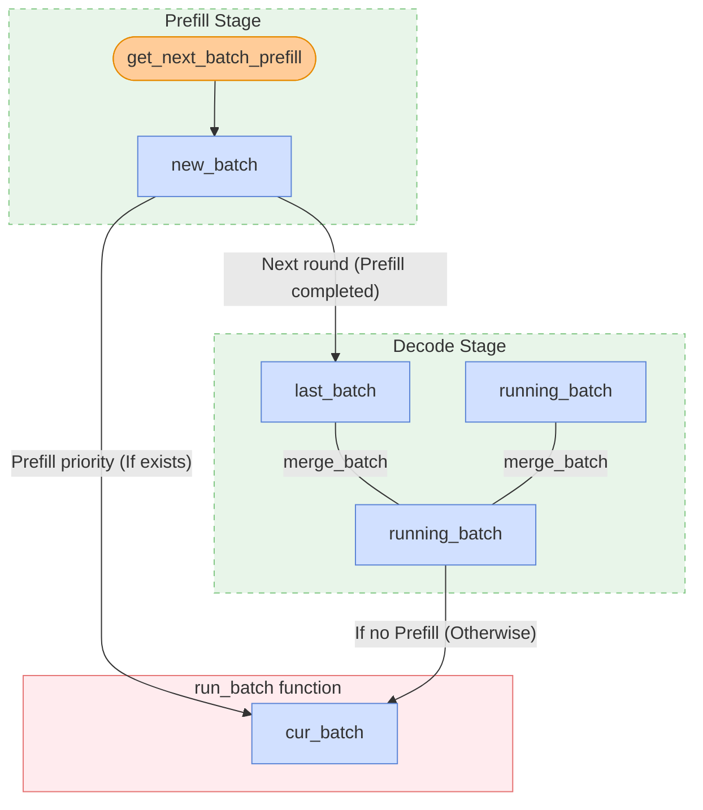

# From KV Cache to Zero Overhead Scheduling: Understanding SGLang's Scheduling Ingenuity

I've been wanting to systematically study the SGLang Scheduler for a year now. Around November '24, some friends and I wrote the [SGLang Code Walkthrough](https://github.com/zhaochenyang20/Awesome-ML-SYS-Tutorial/blob/main/sglang/code-walk-through/readme-CN.md), but we stopped at KV Cache Management and Scheduler analysis. Since then, a whole year has passed, and the SGLang project has undergone earth-shaking changes. However, in my opinion, the scheduling algorithm itself has long since converged. The most significant innovation remains the [zero-overhead batch scheduler](https://lmsys.org/blog/2024-12-04-sglang-v0-4/#zero-overhead-batch-scheduler) completed by lianmin in December '24. Since then, much of SGLang's optimization has been on the MoE architecture. I've been busy dealing with various RL frameworks, so the idea of studying SGLang KV Cache and Scheduler was put on hold. But this was always on my mind; otherwise, seeing discussions in SGLang technical groups that I didn't understand would cause deep technical anxiety.

Furthermore, Junrong (a member of the Qwen RL Infra team and an old SGLang RL teammate) once told me, "Nowadays, I feel that the upper limit of RL infra often depends on the level of understanding of SGLang and Megatron themselves." This often reminds me that a deep understanding of inference and training systems is key to driving RL infra development. Indeed, I have written many deep thoughts on RL systems before, such as:

1. [Deep Dive into DeepSeek MoE: Classical Secondary Development of EP and FSDP](../../rlhf/sys-design/readme-4.md)
2. [RL System Reflections: Deep Understanding of Weight Update Mechanisms](../../rlhf/sys-design/readme-1.md)
3. [RL System Reflections: FSDP Training Backend](../../rlhf/sys-design/readme-2.md)

This article will follow the logic of the above three articles to deeply understand SGLang's scheduling system, from KV Cache to Overlapped Scheduling, explaining SGLang's scheduling ingenuity in one go.

[Special thanks to Liu Zhiyi's original article [SGLang Scheduler Evolution](https://zhuanlan.zhihu.com/p/1969077475129688722)]

Considering that the scheduling system is perhaps the most complex central component of SGLang, I have revised the writing structure several times for easier understanding. Generally, I will first isolate several important classes and data structures, and then analyze the overall workflow of the scheduler.

## Key Class and Data Structure

First, let's review two high-level architecture diagrams of SGLang:

<div style="text-align: center;">

</div>

<div style="text-align: center;">

</div>

### Scheduler

The `Scheduler` manages all active requests through the following core logic objects:

1. `waiting_queue`: As the name suggests, `waiting_queue` is a priority queue for all active requests. All requests that haven't finished prefill and requests retracted during the decode phase are placed here. Before each loop, if the queue is not empty, the Scheduler calls `self.policy.calc_priority(self.waiting_queue)` to reorder the queue based on preset strategies (like FCFS, longest prefix match, etc.), and then forms a `new_batch` via `PrefillAdder`.

A request is considered to have "completed Prefill" only after the last chunk is processed, moving it to the Decode phase. In an intermediate state, it is neither in the `waiting_queue` (since it has started running) nor in the traditional `running_batch` (since it hasn't reached Decode); it is managed by the Scheduler through a separate `self.chunked_req` variable.

2. `new_batch`: Requests about to enter the prefill/extend phase. Given the characteristics of chunked prefill, if a request is very long and exceeds `chunked_prefill_size`, it will be marked with `self.chunked_req = True` and handled specially: it only joins the `running_batch` for Decode once all its chunks are prefilled. In the intermediate state, it's held by `self.chunked_req`. The full scheduling trajectory for a new request is: `waiting_queue -> new_batch (current round) -> last_batch (start of next round) -> running_batch (merged)`; while for requests already in decode: `running_batch -> cur_batch (current round) -> running_batch (start of next round)`.

3. `running_batch`: Requests about to enter the decode phase. When GPU memory (KV Cache Pool) is heavily fragmented or insufficient for the next token of all requests, the Scheduler uses `retract_decode` to withdraw some requests from `running_batch` back to `waiting_queue`. (PS: Honestly, the names `running_batch` and `new_batch` are somewhat misleading. It might be more accurate to call them `decode_batch` and `prefill_batch`.)

4. `cur_batch`: The requests currently being processed in the Scheduler's main loop function `run_batch`. Note that SGLang is prefill-first; it only enters the decode phase when no new prefill batch exists. Thus, if `new_batch` exists, `cur_batch = new_batch`, otherwise `cur_batch = running_batch`.

```python
def get_next_batch_to_run(self):
    # Core detail: Only if the last round was Prefill (Extend), do we need to merge into the Decode queue
    if self.last_batch and self.last_batch.forward_mode.is_extend():
        self.running_batch.merge_batch(self.last_batch)
    
    # Prefill priority strategy
    new_batch = self.get_new_batch_prefill()
    if new_batch:
        return new_batch
    else:
        # If no Prefill, update and run Decode
    return self.update_running_batch(self.running_batch)
```



### Batch

`waiting_queue, new_batch, running_batch, cur_batch` describe the control logic of a request. Here we analyze four batch-related classes defined in the Scheduler: `ScheduleBatch`, `ModelWorkerBatch`, `ForwardBatch`, and `GenerationBatchResult`. They describe the data structures actually executed on different hardware resources. Note that `waiting_queue, new_batch, running_batch, cur_batch` are all instances of `ScheduleBatch`.

1. **`ScheduleBatch`**

`ScheduleBatch` is managed by the Scheduler and contains high-level scheduling information, with most data residing on the CPU.

```python
class ScheduleBatch:
    reqs: List[Req]  # List of requests
    req_to_token_pool: ReqToTokenPool  # Mapping pool of all tokens for all requests to kv cache
    token_to_kv_pool_allocator: BaseTokenToKVPoolAllocator  # KV cache allocator
    tree_cache: BasePrefixCache  # Prefix cache tree
    forward_mode: ForwardMode  # Forward mode

    # Batch related
    input_ids: torch.Tensor  # Input token IDs
    seq_lens: torch.Tensor  # Sequence lengths of all requests
    extend_lens: List[int]  # Extension lengths (seq_len - prefix_len)
    prefix_lens: List[int]  # Prefix lengths of all requests
```

2. **`ModelWorkerBatch`**

`ModelWorkerBatch` is managed by `TpModelWorker` and contains only data related to model forward on the GPU. it will be converted from the CPU Scheduler to the GPU ModelRunner.

```python
class ModelWorkerBatch:
    forward_mode: ForwardMode
    input_ids: torch.Tensor # Input token IDs
    req_pool_indices: torch.Tensor # Indices for out_cache_loc for all requests
    seq_lens: torch.Tensor # Sequence lengths of all requests
    out_cache_loc: torch.Tensor # KV cache slot indices for new tokens in this batch
```

3. **`ForwardBatch`**

`ForwardBatch` is managed by `ModelRunner` and contains only data related to model forward on the GPU, including the low-level tensor data.

```python
class ForwardBatch:
    forward_mode: ForwardMode
    batch_size: int
    input_ids: torch.Tensor
    seq_lens: torch.Tensor
    positions: torch.Tensor  # Position encodings
```

4. **`GenerationBatchResult`**

`GenerationBatchResult`, as the name suggests, is the output of the model forward.

```python
class GenerationBatchResult:
    logits_output: torch.Tensor # Full logits output and related info from model forward
    next_token_ids: torch.Tensor # Next token IDs after sampling
    num_accepted_tokens: int # Number of accepted tokens in speculative decoding
    next_draft_input: Optional[EagleDraftInput] # Next round input for speculative decoding
    extend_input_len_per_req: List[int] # Extension input length per request
    extend_logprob_start_len_per_req: List[int] # Starting position for logprob calculation per request
    copy_done: torch.cuda.Event # Synchronization event for GPU to CPU data transfer
    delay_sample_func: Optional[callable] # Delayed sampling function
    future_indices: Optional[FutureIndices] # Index information in the Future mechanism
```

In `TpModelWorker::forward_batch_generation`, after the GPU completes inference (Forward) and sampling (Sample), it packs all outputs into `GenerationBatchResult` and returns it to the Scheduler.

```python
# TpModelWorker.py illustrative code
def forward_batch_generation(self, model_worker_batch):
    # 1. Run model forward
    logits_output = self.model_runner.forward(forward_batch)
    # 2. Sample to get tokens
    next_token_ids = self.model_runner.sample(logits_output, forward_batch)
    
    # 3. Pack and return all results
    return GenerationBatchResult(
        logits_output=logits_output,
        next_token_ids=next_token_ids,
        ...
    )
```

After receiving `GenerationBatchResult` in the main loop, the Scheduler updates each request's state based on the carried information, mainly in the `process_batch_result` function:

- **Update Token**: Append values from `next_token_ids` to each request's `output_ids`.
- **Determine Termination**: Check if the new token is a stop token (EOS); if so, remove the request from `running_batch`.
- **Streaming Output**: Based on logprob info in `logits_output`, push results to the frontend via `stream_output` if it's a streaming request.
- **Resource Release**: If a request completes, notify Radix Cache to release or cache the corresponding KV Cache.

Note that in Zero Overhead Scheduling (discussed later), CPU scheduling is overlapped with GPU computation. In this mode, `GenerationBatchResult` is key to asynchronous non-blocking scheduling:

- **Delayed Sampling (`delay_sample_func`)**: In overlap mode, the GPU doesn't immediately block after forward; it returns a `result` containing a sampling function. The Scheduler can use the GPU sampling gap to process post-scheduling for the previous batch.
- **Synchronization Token (`copy_done`)**: Carries a CUDA Event. When the CPU truly needs to access token IDs (e.g., to send to a user), it calls `result.copy_done.synchronize()`, ensuring it doesn't read incomplete data.
- **Placeholder Management (`future_indices`)**: In overlap mode, current output is the next batch's input. `GenerationBatchResult` records these tokens' positions in the GPU `FutureMap`, allowing the next batch to read results directly from GPU memory without CPU transit.

### KV Cache Management

Scheduling itself involves little KV Cache management directly, so it can be analyzed separately. Interestingly, when SGLang first launched, the combination of RadixCache and PagedAttention gave it a massive throughput advantage over vLLM (which only used PagedAttention then). This was around August 2024, when I first joined the SGLang community. Back then, I mistakenly thought RadixCache and PagedAttention competed for the same role. Even when Ying Sheng told me they weren't contradictory, I didn't fully grasp their relationship. It wasn't until I recently re-examined the Scheduler that I understood: by early 2025, both are standard in SGLang and vLLM, acting like "multi-level indexing" in an OS.

Actually, Paged Attention is like an OS page table, solving the "logical cache address to physical storage address" mapping; it lets logically continuous KV Cache be scattered in physical VRAM to reduce fragmentation. Radix Cache handles "cache reuse"; requests with the same prefix can reuse logical cache addresses, avoiding redundant computation.

| Dimension | Paged Attention (Addressing Layer) | Radix Cache (Strategy Layer) |
| :--- | :--- | :--- |
| Problem Solved | Memory fragmentation. Logically continuous but physically discrete. | Redundant computation. Sharing KV data across requests. |
| OS Analogy | Page Table: Maps virtual addresses to physical pages. | Shared Libraries/File Cache: Multiple processes sharing memory blocks. |
| Focus | "How to store": Utilizing non-contiguous memory. | "What to store": Which prefixes are identical and reusable. |
| Relationship | Without paging, sharing is hard due to fragmentation. | Leverages paging flexibility for extreme reuse. |

With this knowledge, let's look at a three-request example involving `RadixCache`, `req_to_token_pool`, and `token_to_kv_pool`. Suppose the system is processing these requests sharing a prefix:

```python
# Assume the system already processed "A, B" before Request 1, with physical Slot Indices [10, 11].

- Request 1: ["A", "B", "C", "D"]
- Request 2: ["A", "B", "C", "F"]
- Request 3: ["A", "B", "G", "H"]
```

Requests pass through three cache layers for scheduling and computation:

1. **L1 Cache: RadixCache Logical Layer**

RadixCache is the entry point for scheduling, maintaining long-term mappings between logical token sequences and physical addresses. A new Request first checks RadixCache for an existing prefix. If hit, RadixCache returns the corresponding physical Slot Indices. For Request 1, since "A, B" exists, it returns [10, 11] and locks these slots (`lock_ref += 1`) to prevent eviction. RadixCache is a Radix Tree where each node (`TreeNode`) stores a token sequence and its physical Slot Indices. Each node has a `lock_ref`; as long as a request uses it, the node and its physical slots are safe from eviction. When memory is low, RadixCache decides which unreferenced "cold prefixes" to evict.

```python
class TreeNode:
    def __init__(self, token_ids, slot_indices):
        # Logical ID: Token sequence representing the path from root to this node
        self.key = token_ids       # e.g., ["A", "B", "C"]
        
        # Physical Indices: Corresponding Slot Indices in token_to_kv_pool
        self.value = slot_indices  # e.g., [10, 11, 12]
        
        # Reference count: How many active requests are using this node
        self.lock_ref = 0          # Node and slots are non-evictable if lock_ref > 0
        
        # Tree structure: Child branches
        self.children = {}
        
        # Eviction metadata: LRU timestamp
        self.last_access_time = time.time()

class RadixCache:
    def match_prefix(self, token_ids):
        # 1. Search for longest prefix in the tree
        # 2. On hit, increment lock_ref for all nodes on the path
        # 3. Return physical Slot Indices for ReqToTokenPool to build the "page table"
        return matched_slot_indices

    def evict(self, num_slots_to_free):
        # 1. Scan leaf nodes where lock_ref == 0
        # 2. Sort by last_access_time (LRU)
        # 3. Release physical slots and delete nodes until enough space is freed
        pass
```

2. **L2 Cache: ReqToTokenPool Addressing Layer**

`ReqToTokenPool` is a 2D matrix where row index is request ID and column index is token position, storing the actual physical address (`location`) of each token's KV Cache.

After RadixCache, the Scheduler writes the returned Slot Indices into the request's row in `req_to_token_pool`. For the private part (not in RadixCache), the Scheduler requests new physical slots and writes them subsequently. For Request 1, "A, B" hit [10, 11], and private "C, D" get new slots [12, 20]. So, R1's row is `[10, 11, 12, 20]`.

| Req ID (`req_pool_idx`) | Pos 0 | Pos 1 | Pos 2 | Pos 3 | Description (Radix Cache Decision) |
| :--- | :--- | :--- | :--- | :--- | :--- |
| **Request 1 (R1)** | **10** | **11** | **12** | **20** | Shared ABC, Private D |
| **Request 2 (R2)** | **10** | **11** | **12** | **25** | Shared ABC, Private F |
| **Request 3 (R3)** | **10** | **11** | **40** | **41** | Shared AB, Private GH |

Actually, `req_to_token_pool` size is `[request_num, max_context_len]`:

```python
class ReqToTokenPool:
    def __init__(self, size: int, max_context_len: int, device: str, enable_memory_saver: bool):
        # Main storage: [number of requests, max context length]
        self.req_to_token = torch.zeros(
            (size, max_context_len),
            dtype=torch.int32,
            device=device
        )
        self.free_slots = list(range(size))  # List of available slots
        self.size = size
        self.max_context_len = max_context_len
```

Note: When the GPU finishes computing private KV Cache, the Scheduler calls `radix_cache.insert()` to add those private slots (e.g., R1's `[12, 20]`) and tokens (e.g., `[C, D]`) back to the tree. Now R1's private nodes are shared resources, allowing R2 to hit the `"A, B, C"` prefix.

3. **L3 Cache: TokenToKVPool Physical Layer**

Finally, `token_to_kv_pool` is where KV Tensors actually reside in GPU memory.

After L1 and L2 mapping, KV Cache for the new Request is found or allocated. The Scheduler batches requests for Forward. During Forward, GPU kernels read Slot Indices from `req_to_token_pool` to find KV Tensors in `token_to_kv_pool`. Thanks to Paged Attention, physical slots needn't be contiguous. For R1, the GPU just needs `[10, 11, 12, 20]` from `req_to_token_pool` to find the Tensors in `token_to_kv_pool`, even if they are physically far apart.


| Physical Slot (Slot Index) | ... | 10 | 11 | 12 | ... | 20 | ... | 25 | ... | 40 | 41 | ... |
| :--- | :--- | :--- | :--- | :--- | :--- | :--- | :--- | :--- | :--- | :--- | :--- | :--- |        
| KV Data Content | other token | [A] | [B] | [C] | other token | [D] | other token | [F] | other token | [G] | [H] | other token |
| Sharing Status (Strategy) | unknown | Shared R1-R3 | Shared R1-R3 | Shared R1-R2 | unknown | Private R1 | unknown | Private R2 | unknown | Private R3 | Private R3 | unknown |

<div style="text-align: center;">

</div>

## Normal Scheduler

With these data structures, let's look at the Normal Scheduler flow. A single request's flow is:

```text
Req → { Pre Schedule(CPU) → Compute Batch → Sample(GPU) → Post Schedule(CPU) } → { Pre Schedule(CPU) → ...
```

Or in pseudo-code:

```python
def event_loop_normal(self):
    """A normal scheduler loop."""
    while True:
        # 1. Receive requests and handle queuing
        recv_reqs = self.recv_requests()
        self.process_input_requests(recv_reqs)
        
        # 2. Get next batch to run (Prefill prioritized)
        batch = self.get_next_batch_to_run()
        self.cur_batch = batch
        
        if batch:
            # 3. Run inference and sampling
            result = self.run_batch(batch)
            # 4. Post-processing (Update state, stream output, release cache)
            self.process_batch_result(batch, result)
        else:
            # Idle self-check and reset
            self.self_check_during_idle()
            
        self.last_batch = batch
```

### Pre Schedule

1. **Entering Waiting Queue (`Req → Waiting_queue`)**

Key functions: `Schedule::recv_requests` and `Schedule::process_input_requests`. The former gets requests via zmq; the latter unpacks, constructs `Req` objects, inserts them into `waiting_queue`, and signals the tokenizer.

```python
def recv_requests(self):
    """Receive requests from tokenizer manager."""
    return self.tokenizer_manager.recv_requests()

def process_input_requests(self, recv_reqs):
    """Process input requests."""
    for recv_req in recv_reqs:
        worker_id = recv_req.worker_id
        recv_req = recv_req.obj
        output = self._request_dispatcher(recv_req)
        self._add_request_to_queue(output)
        self.tokenizer_manager.send_response(worker_id, output)
```

2. **Pre Schedule Prefill (`waiting_queue → new_batch`)**

New requests in `waiting_queue` first enter Prefill.

- `PrefillAdder::get_new_batch_prefill`: Selects requests for a Prefill Batch.
- `Req::init_next_round_input()`: Matches `input_ids` in RadixCache for prefix length.
- `ScheduleBatch::prepare_for_extend()`: Assigns `req_pool_indices` in `req_to_token_pool`; calculates `new_slots_count` and allocates new slots from `token_to_kv_pool`; then updates `req_to_token_pool` by concatenating matched and new slots.

[Question: `req_to_token_pool` is updated after slot allocation, but when is Radix Cache updated?]

3. **Pre Schedule Decode (`running_batch → cur_batch`)**

- `update_running_batch`: Identifies requests with EOS or Length Limit. Merges `last_batch` (finished Prefill) into `running_batch`.
- `retract_decode`: If KV Pool is low, retracts requests (typically LRU) back to `waiting_queue` for later re-prefill.
- `ScheduleBatch::prepare_for_decode()`: Allocates one new slot per request from `token_to_kv_pool` and updates `req_to_token_pool`. Unlike Prefill's bulk allocation, Decode allocates `bs * 1` slots.

### Compute Batch & Sample

GPU runs `Forward`, then samples from logits to get `next_token_ids`:

```python
next_token_ids = self.sampler(
    logits_output,
    forward_batch.sampling_info,
    # Prefill samples at sequence end (seq_lens - 1)
    # Decode samples at current positions
    indices = (forward_batch.positions if is_decode else forward_batch.seq_lens - 1),
    ...
)
```

### Post Schedule

1. `result.copy_done.synchronize()`: Syncs to ensure CPU reads accurate `next_token_ids`.
2. `req.output_ids.append(next_token_id)`: Appends token to request.
3. `tree_cache.cache_unfinished_req(req)`: Updates LRU timestamp and locks path.
4. `tree_cache.cache_finished_req(req)`: Decrements node's `lock_ref` for completed requests.
5. `stream_output()`: Pushes results to client.
6. `cache_unfinished_req(req)`: Updates Radix Cache (L1) nodes for future sharing.

Note: `token_to_kv_pool` (L3) and `req_to_token_pool` (L2) update in Pre Schedule, while Radix Cache updates in Post Schedule. Updating Radix Cache early could lead concurrent requests to hit prefixes whose KV data isn't fully written yet. Post Schedule ensures KV is safe for sharing.

## Overlap Scheduler: Hiding Scheduling Overhead Behind Operators

In Normal Scheduler, CPU scheduling and GPU computation are serial. This blocking mode limits performance if CPU prep time creates bubbles during fast Decode steps. Profiling shows core scheduling algorithms are fast; the bottleneck is Python's heavy I/O:

1. **Pre Schedule**: Building complex input tensors, preparing Sampling Info, distributing metadata.
2. **Post Schedule**: Detokenization, checking termination (EOS/Length).

Solutions include reducing scheduling frequency (Multi-step Scheduling) or asynchronous masking (Overlap Scheduling). To explain these, why does Sampling happen on the GPU?

Sampling seems inefficient for a GPU since it's not a matrix multiply, but transmitting logits to the CPU is costly. For Batch Size 256 and Vocabulary 128,000 (Llama-3), logits are `[256, 128000]`. At bf16 (2 bytes), that's $\approx 65 \text{ MB}$ per step. Even with PCIe 4.0, moving this every step adds latency exceeding inference time. GPU sampling (Argmax or Top-P) reduces this to < 1 KB (just Token IDs). In traditional frameworks, Sampling is on GPU, but CPU still waits (Synchronize) for Token IDs before the next round—this is the Normal Scheduler.

Scheduling involves four events and their locations:

| Event | Location |
| :--- | :--- |
| Pre Schedule | CPU Heavy |
| Compute Batch | GPU Heavy |
| Sample | GPU Heavy |
| Post Schedule | CPU Heavy |

### Multi-step Scheduling vs. Overlap Scheduling

**Multi-step Scheduling**

Can we reduce CPU scheduling frequency by generating multiple tokens per call? This is Multi-step Scheduling: Amortize. The CPU gives the GPU a command for, say, 5 steps. The GPU runs a loop kernel, sampling in VRAM and filling the next input buffer without returning to Python.

While this cuts CPU overhead, it loses flexibility: EOS response is delayed (GPU continues for the full 5 steps even if a request ends at step 2), and high-priority requests must wait for the cycle to end.

**Overlap Scheduling**

Overlap Scheduling keeps single-step scheduling but hides CPU overhead inside GPU computation. However, step $N+1$ depends on step $N$'s token. If the CPU schedules $N+1$ without $N$'s token, it lacks input.

SGLang's `FutureMap` enables a pre-fill strategy:

1. **CPU Side: Symbolic Linking**: When preparing Batch N, the CPU reserves slots in the GPU `FutureMap`. Even before Batch N finishes, the CPU knows its tokens will go to `FutureMap` slot X. When prepping Batch N+1, it uses a symbolic reference to slot X for the input position, linking N (Output) to N+1 (Input) logically.

2. **GPU Side: Lazy Resolution**: Batch N+1's command is sent to `forward_stream`. Before inference, a tiny Resolve Kernel runs. Since `forward_stream` is FIFO, Batch N's Sample has already written real tokens to `FutureMap[X]`. The Resolve Kernel reads these and replaces the symbolic input.

3. This allows the CPU to launch subsequent batches without touching real data or cross-device sync, achieving Overlap Scheduling.

As batches pipeline, GPU Compute N+1 and Sample N+1 overlap with Post Schedule N and Pre Schedule N+1. Overlap Scheduling remains flexible with fine-grained control, EOS response, and preemption, at the cost of complex implementation with CUDA Streams and Future mapping.

### Overlap Event Loop

Finally, let's see how `event_loop_overlap` in `scheduler.py` ensures maximum parallelism:

```python
def event_loop_overlap(self):
    self.result_queue = deque()  # Stores (batch, result)
    while True:
        # 1. Pre Schedule (Batch N+1)
        recv_reqs = self.recv_requests()
        self.process_input_requests(recv_reqs)
        batch = self.get_next_batch_to_run() 

        if batch:
            # 2. Launch Compute Batch (Batch N+1) -> Non-blocking submission
            batch_result = self.run_batch(batch) 
            self.result_queue.append((batch.copy(), batch_result))

        # 3. Post Schedule (Batch N)
        # Realizes CPU (Post-Schedule N) and GPU (Compute N+1) parallelism
        if self.last_batch:
            tmp_batch, tmp_result = self.result_queue.popleft()
            # Sync for CPU data readiness, without affecting GPU's Compute N+1
            self.process_batch_result(tmp_batch, tmp_result)

        # 4. Launch Sample (Batch N+1)
        # Runs after Post-Schedule N to ensure vocab mask for N+1 is updated
        self.launch_batch_sample_if_needed(batch_result)
        
        self.last_batch = batch
```
