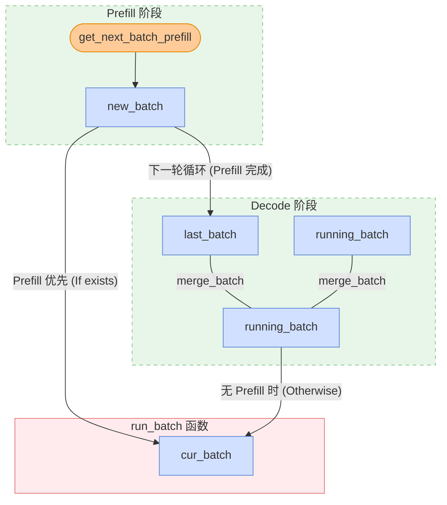

# 从 KV Cache 到 Zero Overhead Scheduling，一文读懂 SGLang 的调度巧思

想要系统性学习 SGLang Scheduler 的想法已经有一年了。大概在 24 年 11 月，当时我和几个朋友一起写了 [SGLang Code Walkthrough](https://github.com/zhaochenyang20/Awesome-ML-SYS-Tutorial/blob/main/sglang/code-walk-through/readme-CN.md)，但是当时止步于 KV Cache Management 和 Scheduler 分析，并未更进一步。从那时起，已经有了一整年，SGLang 项目也发生了翻天覆地的变化。但是，在我看来，Scheduling 算法本身早已收敛，最大的创新还是 24 年 12 月时，怜悯主力完成的 [zero-overhead batch scheduler](https://lmsys.org/blog/2024-12-04-sglang-v0-4/#zero-overhead-batch-scheduler)。此后，SGLang 很长时间的优化都是在 MOE 架构上。我自己也一直在忙着和诸多 RL framework 打交道，学习 SGLang KV Cache 和 Scheduler 的想法就一直搁置。但是，这个事情必然是悬在我心上的，否则经常看到在 SGLang 的各种技术讨论群里，大家聊的内容有许多我都毫不了解，让人产生了深深的技术焦虑。

更进一步，Junrong（Qwen RL Infra team 成员，也是 SGLang RL 老队友）有次给我说过，“现在感觉，很多时候 RL infra 的上限，其实取决于对 SGLang 和 Megatron 本身的理解程度”。他这话时常点醒我，对推理和训练系统本身的深刻认知，是推动 RL infra 发展的关键。事实也是如此，之前本人写了非常多 RL 系统深思，比如：

1. [深入浅出 DeepSeek MoE，EP 与 FSDP 经典二次开发](../../rlhf/sys-design/readme-4.md)
2. [RL 系统深思：深入理解权重更新机制](../../rlhf/sys-design/readme-1.md)
3. [RL 系统深思：FSDP 训练后端](../../rlhf/sys-design/readme-2.md)

这篇文章会 follow 以上三篇文章的思路，深入理解 SGLang 的调度系统，从 KV Cache 到 Overlapped Scheduling，一文读懂 SGLang 的调度巧思。

【感谢刘芷溢的 [SGLang Scheduler 技术变迁](https://zhuanlan.zhihu.com/p/1969077475129688722)原文】

考虑到 Scheduling 系统几乎是 SGLang 最复杂的中心组件，为了便于理解，这篇文章的写作思路有过多次改动。总体上我会先单独抽出几个重要的 class 和数据结构，接着再从整体上分析调度器的工作流程。

## Key Class and Data Structure

首先，回顾下 SGLang 的两个粗浅的架构图：


<div style="text-align: center;">

</div>

<div style="text-align: center;">

</div>

### Scheduler

Scheduler 通过如下的核心逻辑对象来管理所有的 active request：

1. `waiting_queue`：顾名思义，`waiting_queue` 是一个优先队列，用于存放所有的 active request。所有还没有完成 prefill 的 request 和在 decode 阶段被 retract 回来的 request 都会被放入队列中；每轮循环之前，如果队列不为空，Scheduler 会调用 `self.policy.calc_priority(self.waiting_queue)` 函数，根据预设的策略（如 first come first serve、最长前缀匹配等）对队列进行重新排序，然后通过 `PrefillAdder` 组成 `new_batch`。

2. `new_batch`：即将进入 prefill/extend 阶段的 requests。考虑到 chunked prefill 的特性，如果一个请求非常长，超过了 `chunked_prefill_size`，它会被标记为 `self.chunked_req = True`，接着被特殊处理：只有当这个请求的所有 chunks 都 prefill 完成后，它才会从 `last_batch` 真正合并到 `running_batch` 中参与 Decode。状态转换轨迹：`waiting_queue -> new_batch (当前轮) -> last_batch (下一轮开始时) -> running_batch (被合并)`。

3. `running_batch`：即将进入 decode 阶段的 requests。当 GPU 显存（KV Cache Pool）碎片化严重或空间不足以支撑所有请求产生下一个 token 时，Scheduler 会通过  `retract_decode`  从  `running_batch`  中撤回某些 requests，将其返回到  `waiting_queue`。（PS：坦诚说 `running_batch` 和 `new_batch` 这两个命名至少在我看来，是有些误导性的。可能更准确的说法是 `prefill_batch` 和 `decode_batch`）

4. `cur_batch`：在 Scheduler 主循环 `run_batch` 函数中当前正在被处理的 requests。注意到 SGLang 是 prefill first 的，当不存在新的 prefill batch 时，才进入 decode 阶段。因此，当 `new_batch` 存在时，`cur_batch = new_batch`，否则 `cur_batch = running_batch`。

```python
    # 源码简化逻辑 (get_next_batch_to_run)
    new_batch = self.get_new_batch_prefill()
    if new_batch is not None:
        ret = new_batch  # 优先运行 Prefill
    else:
        # 只有在没有新 Prefill 任务时，才更新并运行 running_batch (Decode)
        self.running_batch = self.update_running_batch(self.running_batch)
        ret = self.running_batch
```



### Batch

`waiting_queue, new_batch, running_batch, cur_batch` 描述一个请求的控制逻辑。这里我们分析 Scheduler 中定义的四个和 Batch 相关的 class：`ScheduleBatch`、`ModelWorkerBatch`、`ForwardBatch` 以及 `GenerationBatchResult`，他们描述了在不同的硬件资源，实际被执行的数据结构。注意到，`waiting_queue, new_batch, running_batch, cur_batch` 本质上都是 `ScheduleBatch` 的实例。

1. **`ScheduleBatch`**

`ScheduleBatch` 由 Scheduler 管理，包含高级调度信息，大部分数据位于 CPU 上。

```python
class ScheduleBatch:
    reqs: List[Req]  # 请求列表
    req_to_token_pool: ReqToTokenPool  # 所有 requests 的所有 token 到 kv cache 的映射池
    token_to_kv_pool_allocator: BaseTokenToKVPoolAllocator  # KV cache 分配器
    tree_cache: BasePrefixCache  # 前缀缓存树
    forward_mode: ForwardMode  # 前向模式

    # 批处理相关
    input_ids: torch.Tensor  # 输入 token IDs
    seq_lens: torch.Tensor  # 所有 requests 的序列长度
    extend_lens: List[int]  # 扩展长度 (seq_len - prefix_len)
    prefix_lens: List[int]  # 所有 requests 的前缀长度
```

2. **`ModelWorkerBatch`**

`ModelWorkerBatch` 由 TpModelWorker 管理，只包含与 GPU 上模型 forward 相关的数据，它将从 CPU Scheduler 转换到 GPU ModelRunner。

```python
class ModelWorkerBatch:
    forward_mode: ForwardMode
    input_ids: torch.Tensor # 输入 token IDs
    req_pool_indices: torch.Tensor # 所有 requests 对应的 out_cache_loc 的索引
    seq_lens: torch.Tensor # 所有 requests 的序列长度
    out_cache_loc: torch.Tensor # 这个 batch 的所有 requests 新增的 KV cache slots 索引
```

3. **`ForwardBatch`**

`ForwardBatch` 由 ModelRunner 管理，只包含与 GPU 上模型 forward 相关的数据，包含最底层的 tensor 数据。

```python
class ForwardBatch:
    forward_mode: ForwardMode
    batch_size: int
    input_ids: torch.Tensor
    seq_lens: torch.Tensor
    positions: torch.Tensor  # 位置编码
```

4. **`GenerationBatchResult`**

`GenerationBatchResult` 顾名思义，是模型 forward 的输出结果。

```python
class GenerationBatchResult:
    logits_output: torch.Tensor # 模型 forward 完整的 logits 输出和相关信息
    next_token_ids: torch.Tensor # 经过采样的下一个 token 的 ID
    num_accepted_tokens: int # speculative decoding 中被接受的 token 数量
    next_draft_input: Optional[EagleDraftInput] # speculative decoding 的下一轮输入信息
    extend_input_len_per_req: List[int] # 每个请求的扩展输入长度
    extend_logprob_start_len_per_req: List[int] # 每个请求开始计算 logprob 的位置
    copy_done: torch.cuda.Event # GPU 到 CPU 数据传输完成的同步事件
    delay_sample_func: Optional[callable] # 延迟采样函数
    future_indices: Optional[FutureIndices] # Future 机制中的索引信息
```

在 `TpModelWorker::forward_batch_generation` 中，当 GPU 完成推理（Forward）并进行采样（Sample）后，它会将所有的输出打包为 `GenerationBatchResult`，并返回给 Scheduler。

```python
# TpModelWorker.py 示意代码
def forward_batch_generation(self, model_worker_batch):
    # 1. 运行模型前向
    logits_output = self.model_runner.forward(forward_batch)
    # 2. 采样得到 token
    next_token_ids = self.model_runner.sample(logits_output, forward_batch)
    
    # 3. 将所有结果打包返回
    return GenerationBatchResult(
        logits_output=logits_output,
        next_token_ids=next_token_ids,
        ...
    )
```

Scheduler 在主循环中拿到 `GenerationBatchResult` 后，会根据它携带的信息来更新每个 Request 的状态。这主要发生在 `process_batch_result` 函数中：

- 更新 Token: 将 `next_token_ids` 中的值追加到各个请求的 `output_ids` 中。
- 判断结束: 检查新生成的 token 是否是停止符（EOS），如果是，则将该请求从 `running_batch` 移除。
- 流式输出: 根据 `logits_output` 里的 logprob 信息，如果是流式输出请求，则调用 `stream_output` 将结果推送到前端。
- 释放资源: 如果请求完成，通知 Radix Cache 释放或缓存对应的 KV Cache。

注意到，后文会提及到 Zero Overhead Scheduling 时，也即将 CPU 调度与 GPU 计算进行重叠。在这种调度模式下，`GenerationBatchResult` 是实现异步非阻塞调度的关键：

- 延迟采样 (`delay_sample_func`): 在重叠模式下，GPU 前向计算完成后，并不会立即阻塞等待采样结果，而是先返回一个包含采样函数（sample function）的 `result`。Scheduler 可以利用 GPU 采样的空档去处理上一个 batch 的后处理。
- 同步令牌 (`copy_done`): 它携带了一个 CUDA Event。Scheduler 在真正需要访问 CPU 侧的 token ID 时（比如要把 token 发给用户），会调用 `result.copy_done.synchronize()`。这确保了 CPU 不会读到还没传输完成的脏数据。
- 占位符管理 (`future_indices`): 在重叠模式中，当前的输出是下一个 batch 的输入。`GenerationBatchResult` 记录了这些 token 在 GPU `FutureMap` 中的位置索引，让下一个 batch 的计算能直接从 GPU 显存中读取结果，而不需要经过 CPU 再传递一遍。

